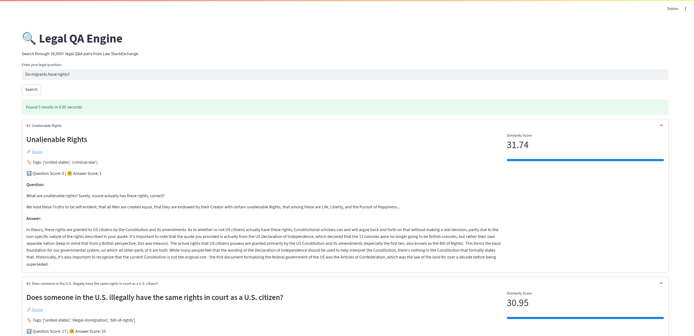

# 🔍 Legal QA Engine with LawStackExchange Dataset


This project implements a semantic search engine that queries over 38,000 legal Q&A pairs from Law StackExchange. The solution uses FAISS indexing for efficient similarity search and Hugging Face transformers for semantic understanding.

## Key Features ✨

- **Semantic Search**: Finds relevant legal Q&As based on meaning, not just keywords
- **Lightning Fast**: Returns results in milliseconds using FAISS indexing
- **Rich Context**: Shows questions, answers, scores, tags, and source links
- **Modern UI**: Clean, responsive interface with visual similarity indicators
- **Open Source**: Built with Python and popular ML libraries

## Technical Implementation 🧠

### Model Architecture
- **Embedding Model**: [`sentence-transformers/multi-qa-mpnet-base-dot-v1`](https://huggingface.co/sentence-transformers/multi-qa-mpnet-base-dot-v1)
- **Search Engine**: [Facebook's FAISS library](https://faiss.ai/index.html)

### Dataset Preparation
The system uses the [Law StackExchange Dataset](https://huggingface.co/datasets/ymoslem/Law-StackExchange) which contains:
- 37,823 Q&A pairs
- Questions with titles, bodies, scores and tags
- Answers with scores and content

### Processing Pipeline
1. **Data Extraction**:
   - Loaded raw StackExchange dataset
   - Exploded answers to create Q&A pairs
   - Blended question, answer and tags into single text

2. **Text Cleaning**:
   - markdown/html to text conversion

3. **Embedding Generation**:
   - Used sentence-transformers model
   - CLS pooling
   - GPU-accelerated processing

4. **Indexing**:
   - FAISS index with inner product metric
   - Efficient similarity search
   - On-disk storage for persistence

### Hardware Configuration
- NVIDIA RTX A4000 (16GB VRAM)

## How to Use 🚀

### Web Interface
Run the Streamlit app for interactive legal queries:
```bash
streamlit run app.py
```



### Search Options
1. **Natural Language Queries**:
   - Ask legal questions in plain English
   - Get semantically similar results
   - Filter by relevance scores

2. **Result Exploration**:
   - Expand results to see full Q&A
   - View community scores and tags
   - Access original source links

### Code Search Example
```python
from datasets import load_from_disk
from transformers import AutoModel, AutoTokenizer
import torch
import faiss

# Load resources
embedding_dataset = load_from_disk('embedding')
embedding_dataset.add_faiss_index(column="embedding", metric_type=faiss.METRIC_INNER_PRODUCT)

checkpoint = 'sentence-transformers/multi-qa-mpnet-base-dot-v1'
model = AutoModel.from_pretrained(checkpoint)
tokenizer = AutoTokenizer.from_pretrained(checkpoint)

# Get embedding for query with CLS pooling
query = "What constitutes self-defense?"
inputs = tokenizer(
    query, padding=True, truncation=True, return_tensors="pt"
)
model_output = model(**inputs)
query_embeddings = model_output.last_hidden_state[:, 0].detach().cpu().numpy()

# Find nearest matches
scores, samples = embedding_dataset.get_nearest_examples("embedding", query_embedding, k=5)
```

## Installation ⚙️

1. Clone repository:
```bash
git clone https://github.com/Ansarill/poetry.git
cd poetry
```
2. Create virtual env (**Python 3.10.12**):
```bash
python3.10 -m venv my_env
source my_env/bin/activate
```
3. Install dependencies:
```bash
pip install -r requirements.txt
```

## Example Search 🔍
**Query**:  
"What is considered to be self-defence?"

**Top Result**:  
**Title**: Self defense after provocation on the part of the defender  
**Tags**: canada, self-defense  
**Answer**: "Canada's law on self-defense can be found here. The force used must be
  "reasonable in the circumstances" and "the person's role in the incident" is listed as a factor to
  be considered. I think that's about all that can be said in general; a court would have to decide
  whether the standard was met in this particular case. Previous versions of the law did explicitly
  limit, but not completely eliminate, the availability of a self-defense justification when the
  person provoked the assault."

## File Structure 📂
```
├── app.py                  - Streamlit application
├── faiss.ipynb             - Jupyter notebook with full implementation
├── embedding/              - Precomputed embeddings for FAISS indexing
├── requirements.txt        - Python dependencies
```

## License 📄
This project is licensed under the Apache License, Version 2.0 - see the [LICENSE](LICENSE) file for details.

---
**Powered by** Hugging Face Transformers and FAISS  
**Legal content from** Law StackExchange community